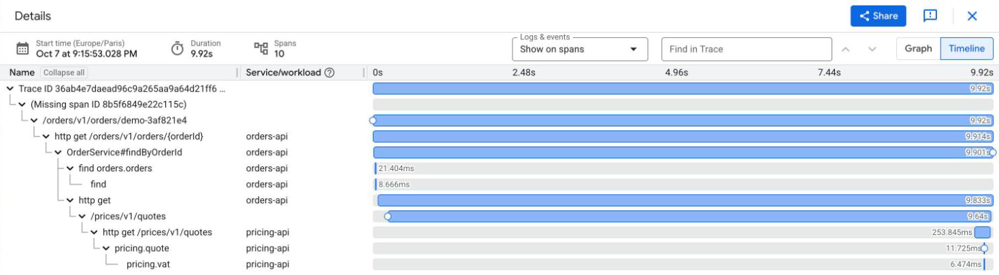

# 🔭 spring-gcp-observability

[](https://github.com/vspiewak/spring-gcp-observability/actions/workflows/build.yml)  

**Observability as a dependency : two Spring Boot services on Cloud Run, one request, one trace across both — every log line filed under it, without a line of Google Cloud code.**

[`spring-paved-road`](https://github.com/vspiewak/spring-paved-road) is the broad picture : the parent, BOM
and starters a Spring Boot fleet inherits. This repo zooms on one capability and takes it all the way
to real cloud infrastructure : one starter, two services, Terraform, Cloud Run, Cloud Logging, Cloud Trace.
The work implementation lives in that paved road ; this is a minimal public reproduction of the pattern.

## 💡 The idea

Three layers, and each knows only what it must :

| Layer | Knows |
|---|---|
| 🧾 [`orders-api`](./orders-api) — a service | its name, its MongoDB, where pricing-api is, `@Observed` — **no Google Cloud code** |
| 🏷️ [`pricing-api`](./pricing-api) — another one | its name, its port, `@Observed` — **no Google Cloud code** |
| 🔭 [`observability-starter`](./observability-starter) — the platform | how traces and logs reach Google : endpoint, token, project attribute, log field names, the sampler |
| ☁️ [`terraform`](./terraform) — the infrastructure | which project, JSON logs on, the database secret, who may write traces, where pricing-api runs |

```text
curl ─► Cloud Run ─► orders-api ─────────────────────────► Cloud Run ─► pricing-api
        front end    │ @Observed                traceparent  front end    │ @Observed
                     ├─ MongoDB Atlas (driver spans)                      │
                     │                                                    │
                     ├─ JSON lines on stdout ─► Cloud Logging ◄───────────┤ JSON lines on stdout
                     └─ OTLP ─► Telemetry API ─► Cloud Trace ◄────────────┘ OTLP
```

One request, one trace : Cloud Run's front-end span, orders-api's, MongoDB's, the call out, Cloud Run's
again, pricing-api's — and every log line of both services filed under that same trace.


## 🧾 What a service contains

One dependency, in both :

```xml
<dependency>
   <groupId>com.vspiewak</groupId>
   <artifactId>observability-starter</artifactId>
</dependency>
```

And this, as orders-api's whole configuration — pricing-api's is its name and its port :

```yaml
spring:
  application:
    name: "orders-api"
  mongodb:
    database: "orders"
pricing:
  url: "http://localhost:8081"
```

The rest is an ordinary controller → `@Observed` service → repository, and a `RestClient` built from
Boot's `RestClient.Builder` to call pricing-api. On Cloud Run, the deployment sets **one** variable for
observability — `GOOGLE_CLOUD_PROJECT`, Google's own — plus, for orders-api, its MongoDB URI (from Secret
Manager) and pricing-api's URL.

## 🔭 What the starter does

Four small classes and two YAML files. The defaults —
[`observability-defaults.yaml`](./observability-starter/src/main/resources/observability-defaults.yaml)
always, [`observability-gcp.yaml`](./observability-starter/src/main/resources/observability-gcp.yaml)
once `GOOGLE_CLOUD_PROJECT` is set — are loaded by an `EnvironmentPostProcessor` *below* the service's
own configuration, so its `application.yaml` wins. Beans do the rest, what properties cannot express.

| | without `GOOGLE_CLOUD_PROJECT` — a laptop | with it — Cloud Run |
|---|---|---|
| traces | every request sampled, `@Observed` on, nothing exported | exported to Cloud Trace |
| logs | Boot's plain console lines, trace id included | one JSON object per line, with Google's fields |

Boot's own switches still apply : `management.tracing.export.enabled=false` stops the export.

### 🎲 A sampler that ignores Cloud Run's decision

Cloud Run hands every request a W3C `traceparent`, but samples at most 0.1 request per second per
instance — most requests arrive flagged *not sampled*. Boot's default sampler is parent-based : it
obeys the flag and drops the service's spans, whatever `management.tracing.sampling.probability` says.

The starter samples on the trace id alone — two lines of defaults, `sampler: trace-id-ratio` and
`probability: 1.0`. Six requests sent in a burst to the deployed service, 2026-10-06 :

| | Cloud Run sampled it | `orders-api` spans in Cloud Trace |
|---|---|---|
| request 1 | yes | 4 |
| requests 2 to 6 | **no** | **4 each** |

Both are defaults : a service's `application.yaml` sets either back. Proven by
[`ObservabilityDefaultsEnvironmentPostProcessorTest`](./observability-starter/src/test/java/com/vspiewak/observability/env/ObservabilityDefaultsEnvironmentPostProcessorTest.java)
— which boots a real `application.yaml` over the defaults, and fails if the post processor runs before
Boot loads it — and by [`TracingIT`](./orders-api/src/test/java/com/vspiewak/orders/platform/TracingIT.java) :
a request flagged `-00` is still recorded, inside the caller's trace. Put Boot's sampler back and that
test fails.

### 📮 Traces to Cloud Trace, over plain OTLP

Boot already traces requests and exports OTLP. The starter adds the three things it cannot know :

* **where** : `https://telemetry.googleapis.com/v1/traces`, Google's OTLP endpoint — one line of
  `observability-gcp.yaml`
* **whose** : a `gcp.project_id` resource attribute on every span, the Telemetry API files spans by
  it — one line too
* **a token, on every export** : the one Google-specific bean, an `OtlpHttpSpanExporterBuilderCustomizer`
  setting the headers as a supplier, from the Application Default Credentials

Google's own `opentelemetry-gcp-auth-extension` is built for the Java agent and the SDK's
autoconfiguration — Boot builds the SDK from beans instead ; the older `exporter-trace` is deprecated.
Proven by [`CloudTraceAutoConfigurationTest`](./observability-starter/src/test/java/com/vspiewak/observability/tracing/CloudTraceAutoConfigurationTest.java).

### 🔗 One trace across services — nothing to write

The trace crosses the network on its own : Boot instruments the `RestClient.Builder` it hands out, so
orders-api's call gets a client span and carries a W3C `traceparent` ; pricing-api's Cloud Run front end
and Boot continue it. The starter's only part is the sampler — orders-api decides, then says *sampled*
downstream, and Cloud Run in front of pricing-api honours it. A burst of six requests, 2026-10-06 :

| orders-api requests | Cloud Run sampled them | orders-api spans | pricing-api spans |
|---|---|---|---|
| 2 | yes | 5 each | 2 each |
| 4 | **no** | **5 each** | **2 each** |

Proven by [`TracingIT`](./orders-api/src/test/java/com/vspiewak/orders/platform/TracingIT.java) —
pricing-api, stood in by a local HTTP server, is called with the request's trace id and the client
span as parent — and by pricing-api's own
[`TracingIT`](./pricing-api/src/test/java/com/vspiewak/pricing/platform/TracingIT.java) : a request
carrying a caller's `traceparent` lands in the caller's trace.

### 🧾 Logs Cloud Logging reads, tied to their trace

Boot 4 writes structured JSON on its own (`ecs`, `gelf`, `logstash`) — but no Google format.
`observability-gcp.yaml` turns Boot's `logstash` on, and a `StructuredLoggingJsonMembersCustomizer`
adds the three fields Google reads — the last three here :

```json
{"@timestamp":"2026-10-06T12:27:07.105549+02:00","@version":"1","message":"found order 42, priced at 8.40",
 "logger_name":"com.vspiewak.orders.services.OrderService","thread_name":"http-nio-auto-1-exec-1",
 "level":"INFO","level_value":20000,"traceId":"83e96be5c1943adb256c48932e38e8fe","spanId":"7e5928ca5099fa19",
 "severity":"INFO",
 "logging.googleapis.com/trace":"projects/<project>/traces/83e96be5c1943adb256c48932e38e8fe",
 "logging.googleapis.com/spanId":"7e5928ca5099fa19"}
```

(one line on stdout ; wrapped here)

`severity` is Google's name for the level (WARN becomes `WARNING`) ; the trace takes the
`projects/<project>/traces/<id>` form Cloud Run's own request log uses, so both land under the same
trace. Proven by [`CloudLoggingJsonMembersCustomizerTest`](./observability-starter/src/test/java/com/vspiewak/observability/logging/CloudLoggingJsonMembersCustomizerTest.java)
and [`CloudLoggingIT`](./orders-api/src/test/java/com/vspiewak/orders/platform/CloudLoggingIT.java) —
which sets nothing but `GOOGLE_CLOUD_PROJECT`.

The span id puts each line on its span — open `OrderService#findByOrderId` in Cloud Trace, and its
log line is right there :


And the trace id files both services' lines together — the same request in the Logs Explorer, queried
by `trace=` : both Cloud Run request logs, then pricing-api's and orders-api's own lines.


### 🍃 MongoDB, traced by its own driver

The driver (5.7+) traces itself once it is handed an `ObservationRegistry` ; Boot does not do it. Every
operation and the command it sends become spans — `find orders.orders`, then `find` — with query
payloads left out. Proven by [`MongoTracingAutoConfigurationTest`](./observability-starter/src/test/java/com/vspiewak/observability/mongo/MongoTracingAutoConfigurationTest.java).

And `@Observed` works without asking — `management.observations.annotations.enabled`, a default too.

## 🛤️ Run it locally

You need **Java 25** — `.sdkmanrc` pins Temurin 25.0.4 — and Docker for the `*IT` tests.

```bash
sdk env install
./mvnw verify                                      # unit + slice + *IT against a real MongoDB, no Google Cloud
./mvnw install -DskipTests                         # once : -pl resolves the starter from ~/.m2
./mvnw -pl pricing-api spring-boot:run             # pricing-api, at localhost:8081
./mvnw -pl orders-api spring-boot:test-run         # orders-api, on a MongoDB container, at localhost:8080
```

Both log the same trace id for a request, in their plain console lines. No project, nothing leaves the
laptop. Give it one — `GOOGLE_CLOUD_PROJECT=<project>`, after `gcloud auth application-default login`
and `gcloud auth application-default set-quota-project <project>` — and the same run logs JSON and sends
its traces to Cloud Trace.

## ☁️ Deploy it

> ⚠️ This creates **real Google Cloud and MongoDB Atlas resources**, and may incur charges. Use a
> project of its own, and tear it down when you are done.

You need `gcloud`, `terraform` (1.9+), a Google Cloud project with billing, and a MongoDB Atlas
organization with a service account (*Organization Project Creator*).

```bash
export TF_VAR_project_id=<your project>

gcloud auth login
gcloud auth application-default login
gcloud auth application-default set-quota-project $TF_VAR_project_id

export TF_VAR_atlas_org_id=<your Atlas organization id>
export MONGODB_ATLAS_CLIENT_ID=<service account client id>
export MONGODB_ATLAS_CLIENT_SECRET=<service account secret>

./scripts/deploy.sh      # terraform apply, then both images (Jib, no Docker), then Cloud Run on them
./scripts/demo.sh        # one request, then its logs and its trace
```

`demo.sh` picks the trace id itself, through `traceparent`, then lists every log line of that trace :

```text
TIMESTAMP  SERVICE_NAME  SEVERITY  MESSAGE                                     REQUEST_URL
09:21:19   orders-api    INFO                                                  https://orders-api-….run.app/orders/v1/orders/demo-634b4e2b
09:21:20   pricing-api   INFO                                                  https://pricing-api-….run.app/prices/v1/quotes?amount=42
09:21:20   pricing-api   INFO      quoted 42 at 50.40
09:21:20   orders-api    INFO      found order demo-634b4e2b, priced at 50.40
```

Both services' Cloud Run request logs and their own lines, one trace — and in Cloud Trace, nine spans :

```text
/orders/v1/orders/demo-634b4e2b              ← Cloud Run's front end
└─ http get /orders/v1/orders/{orderId}      ← orders-api
   └─ OrderService#findByOrderId             ← @Observed
      ├─ find orders.orders                  ← the MongoDB driver
      │  └─ find
      └─ http get                            ← the call to pricing-api
         └─ /prices/v1/quotes                ← Cloud Run's front end, again
            └─ http get /prices/v1/quotes    ← pricing-api
               └─ PricingService#quote       ← @Observed
```

What Terraform builds : the APIs, an Artifact Registry repository, one service account per service —
both may write traces, only orders-api may read its secret — the Atlas project with a free M0 cluster
and its user, the connection string in Secret Manager, and the two Cloud Run services, orders-api told
where pricing-api runs. Run `scripts/deploy.sh` again after any change — a bare `terraform apply` would
put Cloud Run back on the placeholder images.

> ⚠️ **Demo shortcut** : Cloud Run has no fixed outbound IP and the free M0 tier has no private
> networking, so the Atlas cluster accepts connections from anywhere, behind a 32-character random
> password. A real deployment uses a dedicated cluster with a private endpoint, or a static egress IP
> through Cloud NAT. The Terraform state holds that password : keep it local. pricing-api is public
> too : calling it with an identity token would be Cloud Run plumbing, not observability.

### 🧹 Tear it down

```bash
terraform -chdir=terraform destroy
```

It removes everything the demo built — the Cloud Run services, the registry and its images, the secret,
the service accounts and their roles, the Atlas project and its cluster — in about a minute, most of it
waiting on Atlas. What stays : the APIs it enabled, and the traces and logs already written, until
their retention runs out (in the `_Trace` observability bucket and the project's log buckets).

## 📓 Field notes

Measured while building this, on Spring Boot 4.1, Cloud Run and the Telemetry API, October 2026 :

* **Throttled CPU loses spans.** Spans leave in batches, after the response. With Cloud Run's default
  request-based CPU, the export call failed (`Failed to export spans. The request could not be
  executed.`) and the batch was gone ; with `cpu_idle = false`, the same idle request's spans arrived
  within 20 seconds.
* **Every trace starts with a "Missing span ID".** For a request Cloud Run chose not to sample, it
  still hands the service a `traceparent` naming its own span as the parent — but never records that
  span : the service's spans hang under a placeholder. The alternatives are worse : follow Cloud Run's
  decision and most requests leave no trace, start a fresh trace and the service's logs no longer share
  Cloud Run's request log trace id. When Cloud Run does sample, its own span is there — and the
  placeholder moves up one level : Cloud Run's span has a parent of its own, never recorded in the
  project (presumably Google's front end — not documented that we found).
* **A sampled `traceparent` does not force Cloud Run's span.** `demo.sh` asks for sampling, and Cloud
  Run mostly honours it — not always : a GET sent right after the POST that seeds it came back without
  Cloud Run's span, the same GET sent 15 seconds later with it. Cloud Run's 0.1 request per second
  per instance cap looks like the reason. The service's own spans are there either way.
* **The trace shows the cold start.** After forty minutes without traffic, pricing-api had scaled to
  zero : the call to it took 13.3 seconds, of which pricing-api itself spent 200 ms — the rest is Cloud
  Run's front end waiting for an instance to start.

  
* **Trace storage provisions itself, in `us`.** Spans are stored in an observability bucket named
  `_Trace`, created about two minutes after the project's first span — in the `us` location by default.
  Until it exists, reading a trace answers `404 _Trace bucket not found`. Create it yourself first if the
  location matters to you.
* **The very first Cloud Run deployment into a fresh project failed** with an *internal error*, and
  succeeded when run again — `deploy.sh` says so when an apply fails.
* **Spans land about a minute after the request.** Batched in the service for up to five seconds, then
  ingested : a trace read right away can show pricing-api's spans and not yet orders-api's.
* **Trace flags are `03`, not `01`.** OpenTelemetry Java sets W3C Trace Context Level 2's *random trace
  id* bit next to *sampled* ; Cloud Run's front end takes it as sampled.
* **No Spring Cloud GCP.** Its trace starter is built on Brave and Zipkin, not on the OpenTelemetry
  bridge Boot exports from ; the one thing needed from Google, the access token, comes from
  `google-auth-library` directly.
* **The free M0 tier** has no Workload Identity Federation (M10 and up), no peering, no private
  endpoint : the service authenticates with a password.

## ⚖️ At work vs here

| | At work | This repo |
|---|---|---|
| Platform | Java 21 · Spring Boot 3.5 | Java 25 · Spring Boot 4.1 |
| Tracing API | Micrometer Observation over OpenTelemetry, `@Observed` | the same |
| Shape | a capability of the fleet's shared libraries | one starter, two services — yours to fork |
