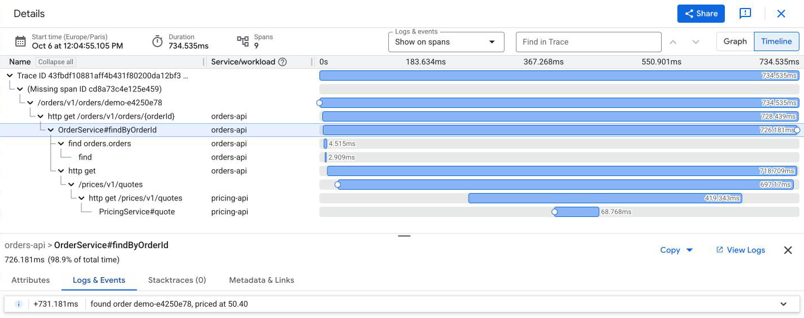
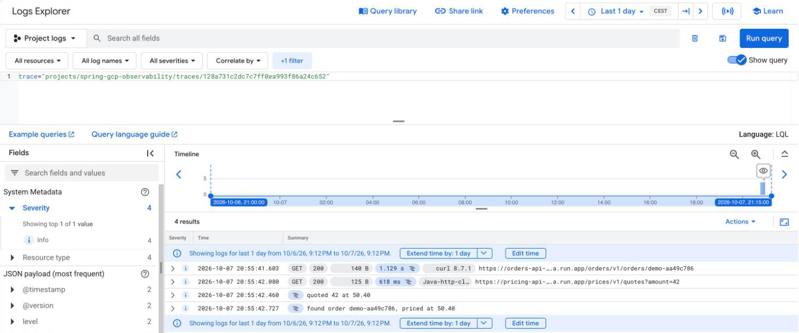
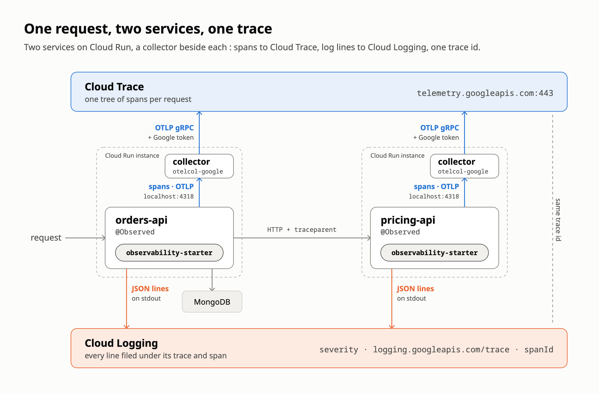

# 🔭 spring-gcp-observability

   [](https://github.com/vspiewak/spring-gcp-observability/actions/workflows/build.yml)

**Observability as a dependency : two Spring Boot services on Cloud Run, one request, one trace across both — every log line filed under it, without a line of Google Cloud code.**

**1** dependency · **1** property · **0** lines of Google Cloud code. One request on Cloud Run, ten spans,
two services :


📝 The story so far : [migrating 1,273 repos in under an hour](https://vspiewak.com/migrating-1200-repos-from-bitbucket-to-github-in-under-an-hour) ·
[27,000+ PRs with gh-auto-updater](https://vspiewak.com/gh-auto-updater-mass-pull-requests-across-a-repo-fleet) — more on [vspiewak.com](https://vspiewak.com)

## 💡 All it takes

```xml
<dependency>
   <groupId>com.vspiewak</groupId>
   <artifactId>observability-starter</artifactId>
</dependency>
```

* 🔑 **one property** — `spring.cloud.gcp.project-id` turns Google Cloud on ; without it, a laptop exports nothing
* 🧼 **no Google Cloud code in the services** — Micrometer's `@Observed` and `Observation`, nothing else
* 🛰️ **one sidecar on Cloud Run** — Google's OpenTelemetry Collector beside each service, from Terraform : the only part that holds Google credentials

## 🚀 Quick start

### 💻 On a laptop

You need **Java 25** — `.sdkmanrc` pins Temurin 25.0.4 — and Docker.

```bash
sdk env install
./mvnw verify                             # unit, slice and *IT tests against a real MongoDB — no Google Cloud
./mvnw install -DskipTests                # once : -pl takes the starter from ~/.m2

docker compose up -d                      # MongoDB, and Jaeger at http://localhost:16686
export MANAGEMENT_OPENTELEMETRY_TRACING_EXPORT_OTLP_ENDPOINT=http://localhost:4318/v1/traces
./mvnw -pl pricing-api spring-boot:run    # :8081 — then, in a second terminal with the same export :
./mvnw -pl orders-api spring-boot:run     # :8080

curl -X POST localhost:8080/orders/v1/orders -H 'Content-Type: application/json' -d '{"orderId": "42", "amount": 7}'
curl localhost:8080/orders/v1/orders/42   # then in Jaeger : one trace across both services
```

### ☁️ On Google Cloud

> ⚠️ This creates **real Google Cloud and MongoDB Atlas resources**, and may incur charges : use a
> project of its own, and tear it down when you are done.

You need **Java 25**, `gcloud`, `terraform` 1.9+, `jq`, a Google Cloud project with billing, and a
MongoDB Atlas organization with a service account (*Organization Project Creator*).

```bash
export TF_VAR_project_id=<your project>
gcloud auth login
gcloud auth application-default login
gcloud auth application-default set-quota-project $TF_VAR_project_id
export TF_VAR_atlas_org_id=<your Atlas organization id>
export MONGODB_ATLAS_CLIENT_ID=<service account client id> MONGODB_ATLAS_CLIENT_SECRET=<its secret>

./scripts/deploy.sh                       # Terraform, both images (Jib, no Docker), Cloud Run — rerun after any change
./scripts/demo.sh                         # one request, its log lines, and links to its trace and logs
terraform -chdir=terraform destroy        # all it built, in about a minute — enabled APIs, logs and traces stay
```

> ⚠️ **Demo shortcuts** : Cloud Run has no fixed outbound IP and the free M0 tier no private
> networking, so the Atlas cluster accepts connections from anywhere, behind a 32-character random
> password kept in the local Terraform state. pricing-api is public too. A real deployment uses a
> dedicated cluster with a private endpoint, or a static egress IP through Cloud NAT.

## 👀 Logs, filed under the trace

What `demo.sh` shows next to that trace — each log line on its span :



And both services' lines, with Cloud Run's request logs, under that one trace in Logs Explorer :



## 🏗️ How it works

The capability-sized sibling of [`spring-paved-road`](https://github.com/vspiewak/spring-paved-road), taken
all the way to real infrastructure — Terraform, Cloud Run, MongoDB Atlas — and back down with one `destroy`.

<picture>
  <source media="(prefers-color-scheme: dark)" srcset="./docs/images/architecture-dark.png">
  
</picture>

| Module | Role |
|---|---|
| 🔭 [`observability‑starter`](./observability-starter) | The platform, as one dependency — the only module that knows Google Cloud |
| 🧾 [`orders‑api`](./orders-api) | A service : MongoDB, a call to pricing-api, `@Observed` on its service — **no Google Cloud code** |
| 🏷️ [`pricing‑api`](./pricing-api) | Another one : a named `@Observed` method and a span of its own — **no Google Cloud code** |
| ☁️ [`terraform`](./terraform) | Cloud Run with the collector beside each service, Artifact Registry, Secret Manager, an Atlas M0 cluster — and who may write traces |

## ✨ What a service gets

**Traces**

* 🎲 **every request traced** — sampled on the trace id, not on Cloud Run's *not sampled* flag · [`TracingIT`](./observability-starter/src/test/java/com/vspiewak/observability/sample/TracingIT.java)
* 📮 **to Cloud Trace, through a collector** — plain OTLP to `localhost`, where Google's OpenTelemetry Collector files the spans under the project and signs them to the Telemetry API : no Google credentials in the service · [`collector.yaml`](./terraform/collector.yaml)
* 🔗 **one trace across services** — Boot's `RestClient` carries the `traceparent`, nothing to write · [`TracingIT`](./observability-starter/src/test/java/com/vspiewak/observability/sample/TracingIT.java)
* 🍃 **MongoDB spans** — the driver traces itself once handed the registry, query payloads left out · [`MongoTracingAutoConfigurationTest`](./observability-starter/src/test/java/com/vspiewak/observability/mongo/MongoTracingAutoConfigurationTest.java)

**Logs**

* 🧾 **JSON that Cloud Logging reads** — Boot's `logstash` format plus `severity`, the trace and the span id · [`CloudLoggingJsonMembersCustomizerTest`](./observability-starter/src/test/java/com/vspiewak/observability/logging/CloudLoggingJsonMembersCustomizerTest.java) · [`CloudLoggingIT`](./observability-starter/src/test/java/com/vspiewak/observability/sample/CloudLoggingIT.java)

**Configuration**

* 🪜 **defaults, never mandates** — two YAML files loaded *below* the service's `application.yaml` : any of it can be set back · [`ObservabilityDefaultsEnvironmentPostProcessorTest`](./observability-starter/src/test/java/com/vspiewak/observability/env/ObservabilityDefaultsEnvironmentPostProcessorTest.java)

**Spans of your own** — three ways, all Micrometer, from [`OrderService`](./orders-api/src/main/java/com/vspiewak/orders/services/OrderService.java)
and [`PricingService`](./pricing-api/src/main/java/com/vspiewak/pricing/services/PricingService.java) :

```java
// 1. every public method, named Class#method
@Service
@Observed
public class OrderService { ... }

// 2. one method, under the name you choose
@Observed(contextualName = "pricing.quote")
public Quote quote(int amount) {
  ...
  // 3. one block
  var vat = Observation.createNotStarted("pricing.vat", observationRegistry)
      .lowCardinalityKeyValue("vat.rate", VAT_RATE.toPlainString())
      .observe(() -> net.multiply(VAT_RATE).setScale(2, RoundingMode.HALF_UP));
  ...
}
```

## 📓 Cloud Run field notes

Building this on Cloud Run surfaced what the docs leave out — throttled CPU losing span batches, the
*Missing span ID* that starts every trace, a cold start you can read in the trace, trace storage that
provisions itself in `us`. Collected in [`docs/field-notes.md`](./docs/field-notes.md).

## ⚖️ At work vs here

| | At work | This repo |
|---|---|---|
| Platform | Java 21 · Spring Boot 3.5 | Java 25 · Spring Boot 4.1 |
| Tracing API | Micrometer Observation over OpenTelemetry, `@Observed` | the same |
| Google Cloud project | a per-environment mandate, chosen by `SPRING_PROFILES_ACTIVE` | `SPRING_CLOUD_GCP_PROJECT_ID`, set by Terraform |
| Shape | a capability of the fleet's shared libraries | one starter, two services — yours to fork |
